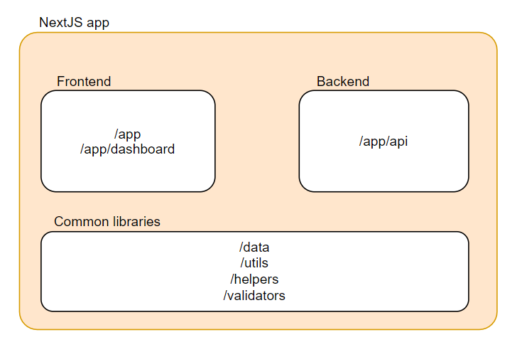
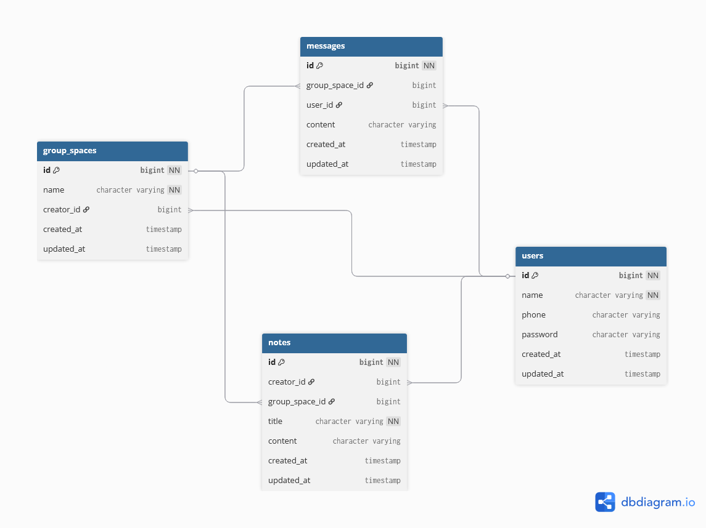

# Dev Log

## Group Chat Application - Functional Requirement

### Group management
1. User can create multiple group
2. User can see all existing group

### Messaging system
1. User can send message to the group
2. User can see message history of the group

### Notes management
1. User can add multiple notes to the group
2. User can edit existing notes in the group
3. Notes content is block-based, similar to Notion's
4. Notes only support text-based content

## Architecture Design

### Project Structure

This project contains all-in-one functionality, including backend. The functionality is separated by certain root directory.

#### Routing

This project follows app-router style as endorsed by NextJS. In general the route path is defined by the directory from `/app`. Therefore given URL `{{BASE_URL}}/dashboard/groups`, the directories are arranged like so: `dashboard > groups > page.tsx`

This style is chosen to adhere to the idiomatic NextJS way to build the application.

### Backend-to-Frontend Communication

This project aimed to do backend and frontend communication with clear separation.

1. Backend data population is done by SQL call. Then these data are presented directly via API route.
2. Frontend data retrieval then requests the data via calling the respective API route.

This means server component does not perform data retrieval (then pass that data to the client component). Most retrieval is happening directly on client side on client components.

The benefit of this separation is allowing flexibility should we need to move from NextJS to other tool for the backend service---given that the application offers chat feature which may need a more complex implementation in high load situation.

### Group chat

Group chat follows pull pattern: client periodically poll the API to get the latest message.

Ideally for a group chat, a channel where data transmitted bidirectionally is preferred, however it doesn't seem NextJS is suitable for that kind of functionality. Therefore, API polling is used in this project.

Chat retrieval use cursor pattern: get N messages before/after certain message. This help performance since DB do not have to run through many rows - the base message filters out many rows therefore reducing number of row need to process.

## Database Design

High level of the database design used is as follows. Detailed SQL can be found in `/migrations` folder.

## Feature Exploration

### Note Taking

#### BlockNote as Library of Choice

This project uses third party library for note editing feature: BlockNote. This library is chosen for its ease of integration---simply create a React element and add it to the application.

Other library i.e. editorjs was considered but ultimately the ease of integration from BlockNote is the tiebreaker.

#### Data Format

BlockNote uses special kind of data structure behind the scene that allows it to be exported as markdown, HTML, pdf and more.

While the project aims to show the note in HTML (i.e. for browser use), it was decided that the note must remain in its original data structure when stored in the database. Main consideration is to support note editing. BlockNote does have capacity to import HTML to be editable in its editor, but such feature is rather limited. To fully support note editing feature, therefore the note is saved in a format BlockNote can read. So BlockNote data is transformed on the fly to HTML when user want to read the note.

The performance degradation is considered. However it is deemed acceptable due to:
1. HTML transformation is done on client side: Server side is released from the burden of transformation especially during high load
2. Client performing transformation may increase bundle size and load time, but as it stands, expected frequency of note viewing is relatively low. Meaning the accumulated load time over time, while not good for user experience, still acceptable.